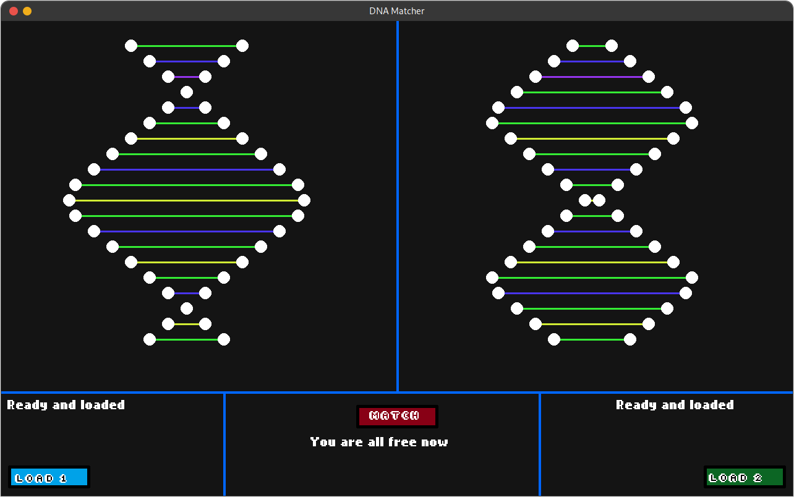

DNA Matcher
===========

The DNA Matcher project is a very simple project with the objective of
simulating how forensics match DNA. This is not an accurate simulation but a
straightforward way of showing how their work is made.

Dependencies
============

* Python 3
* pygame
* tkinter (Windows and Mac)
* zenipy (Linux)
* Levenshtein (dna matcher core)

System requirements
===================

* 256mib RAM
* Around 400mib available of storage
* Screen resolution greater than 1024x768